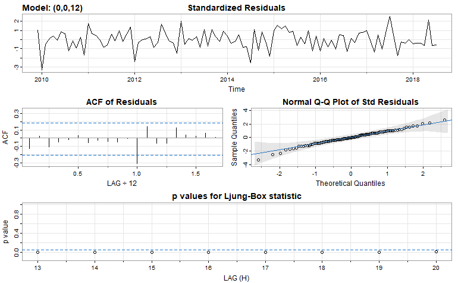

```{r setup, include=FALSE}
knitr::opts_chunk$set(echo = T,
                      results = "hide")
```

```{r,echo=FALSE,warning=FALSE,message=FALSE,results='hide'}
library(tidyverse)
library(astsa)
library(scales)
library(kableExtra)

e_df = read_csv('data/unprocessed/data.csv')
```

# Abstract

This project consists of monthly earthquake forecasting, and uses SARIMA and a Local level state space model to model the magnitude of Indonesian earthquakes from 2008-2022. From looking at the graphs, the time series isn't stationary and seems to have a downward trend. Because of the nature of earthquake data, I took the maximum of each month and year combination and impute the missing data using their respective yearly averages. After doing so, the ACF and PACF shows significant peaks at lag 24. Using this, we estimate p and q as 24 and selected the best model of MA(24) on our data, which achieved an RMSE of 2.528375, and an AIC of 241.46. Thus, the model fits well. Next, we use a local level state space model and after using Maximum likelihood estimating to estimate the parameters in the model, we were able to plot the filtered, smoothed, and predicted data and it looked like a good fit.

\newpage

# Introduction

Hello! Welcome to my project! I am doing monthly forecasting on Earthquake Data from my home country, Indonesia.

My motivation to do this project is that Earthquakes are really devastating and occur really frequently in Indonesia as Indonesia is in an area called the 'Ring of Fire', which is known as an area filled with volcanoes and frequent earthquakes. These earthquakes can, and have lead to tsunamis and can cause massive damage to infrastructures and significant loss of life. Personally, I have relatives of friends and relatives who have experienced life-threatening earthquakes and tsunamis themselves and have lost relatives because of it.

Thus, I wanted to dedicate my project to Earthquakes. Even though I am still developing my data analytic skills, I hope that any findings or results from my analysis of Indonesian Earthquake data can be useful in any way.

Historically, Earthquake prediction have been an extremely difficult topic. In fact the government website on USGS.gov on the question **'Can you predict earthquakes?'** has stated:

"*No. Neither the USGS nor any other scientists have ever predicted a major earthquake. We do not know how, and we do not expect to know how any time in the foreseeable future.*"

> Link: [Can you predict earthquakes? \| U.S. Geological Survey (usgs.gov)](https://www.usgs.gov/faqs/can-you-predict-earthquakes)

However, this is different from what we're doing. Earthquakes prediction is the prediction of a single earthquake's characteristics like location, time, and magnitude. Instead, what we're doing instead is Earthquakes forecasting, and it is possible, and have been done before. Earthquakes forecasting is obtaining a probable estimate of the frequency and magnitude of earthquakes in a given time frame. Historically, this has only been for a time frame of few years, and for specific. However, I wanted to see whether this could be done for monthly as my data is quite limited.

Let's move onto what my dataset looks like.

\newpage

# Data Description

My dataset consists of daily earthquake data 2008 to 2022 from the Indonesian islands. It includes the following variables:

```{r,echo='FALSE'}
kable(e_df %>% head())
```

[**Codebook:**]{.underline}

1.  Date: The date of when the earthquake happened
2.  Time: The exact timestamp of when the earthquake happened
3.  Latitude and Longitude: The coordinates of the earthquake
4.  Depth: The 'hypocenter', or how far under the epicenter's surface where the earthquake happened
5.  Magnitude: The strength of an earthquake measured in Richter scale
    -   1: Very weak, 5: Very Strong

**Summary:**

```{r,echo='FALSE'}
print(e_df %>% summary())
```

The dataset has 87,372 observations. The time frequency is incredibly irregular with some days over 5 earthquakes and some days with no earthquakes recorded, which I will show later in the results.

The data was collected off the Indonesian government agency 'Badan Meteorologi, Klimatologi, dan Geofisika Indonesia', or BMKG for short. It translates to 'Indonesian Agency for Meteorology, Climatology, and Geophysics'. This government agency handles the geological events, which includes recording of earthquakes.

> Dataset Link: [Earthquake Occurrence \| Kaggle](https://www.kaggle.com/datasets/greegtitan/indonesia-earthquake-data)

\newpage

# Methodology

#### SARIMA (p, d, q) x (P, D, Q) model

A SARMA or Seasonal Autoregressive Integrated Moving Average model is a model that mixes autoregressive and moving average parts, and the seasonality of the time series.

The Autoregressive portion of the model tries to map the current observation as a linear combination of previous observations. The p-value tell the model how many of the observations should be used as a linear combination of previous observations.

$$
x_t = \phi_{t-p}*x_{t-p} + w_t
$$

> where $\phi$ is a parameter vector of p-length

The Moving Average portion of the model tries to map the current observation as a linear combination of previous white noises. The q-value tells the model how many white noise should be used to serve as a linear combination of the current observation.

$$
x_t = w_t + \theta_{q}*w_{t-q}
$$

> where $\theta$ is a parameter vector of q-length

The seasonality portion of the model tries to include the periodic nature of the time series to the model.

#### Local Level State Space model

State space model is a way of representing a time series as having an underlying unobserved signal or 'hidden state process' and an observed time series.

For our case, let's try the state space representation of the local level model. It's a simple model that helps me learn state space modelling.

Unobserved State equation:

$$
\mu_t = \mu_{t-1} + w_t
$$

> where $\mu$ is a trend assumed to be a random walk

Observed equation:

$$
y_{t} = \mu_{t} + v_{t}
$$

> where the observed point $y_t$ is an observation in the time series

The goal of a state space model is to deduce the unobserved state process by observing the observation process.

Filtering: To use all the previous data to recursively produces "successive one-step ahead predictions conditional on the past and concurrent observations." (1)

Smoothing: To 'relate the estimate of the one-step ahead prediction to the observation that was realised during the same period of time' (2)

Forecasting: To estimate/predict new data

> *For filtering, smoothing, we will use the Kalman Filter and Smoother*

Estimation of Parameters:Local level model have parameters that needs to be estimated. The estimation can be done by estimating the parameters that maximizes the likelihood that we obtain these observed data.

Also, State space models tend to treat missing data as forecasts and thus, handles missing data very well.

\newpage

# Results

> all R code will be down in the appendix section

#### Pre-processing

Our data actually isn't very nice to begin with. Earthquake data is a time series with lots of problems. For example:

1.  Multiple observations for each day
2.  Irregular time frequency (causes lots of missing data)
    -   In fact, \~15% of my data is missing
3.  Large class imbalance (lots and lots of high earthquakes than low level earthquakes)

Thus, to address these problems, I tried two solutions.

1.  Take the maximum level earthquake of each day and drop the rest
2.  Take the maximum level earthquakes of each month and drop the rest

This works well since all we want to do is to predict or explain the variances of the most impact earthquake, which is the earthquake with the largest magnitude. If we take the mean, we aren't trying to forecast a single earthquake but then the average of all the earthquakes. This won't give significant information as there are too many small earthquakes that doesn't affect humans or buildings at all.

When trying the first approach, I realize that the model was too general for the daily predictions of earthquakes. When using SARIMA to forecast my data, it produced a straight line. I concluded it too general for daily predictions.

Thus, I tried the second approach and it worked better.

#### Feature Engineering

Before performing pre-processing, we will do some EDA and feature engineering. By extracting more features from the data, we can see significant patterns in the data. Here are some features I implemented to the data:

1.  Magnitude Category: the category in which an earthquake is categorized based on its magnitude
    -   \<2.5 : very weak

    -   2.5 \< 5.5: weak

    -   5.5 \< 6: medium

    -   6 \< 7: strong

    -   7 \< 8 : very strong

    -   \>8 : extreme

        -   Scale obtained from <https://www.mtu.edu/geo/community/seismology/learn/earthquake-measure/magnitude/>
2.  Quarters: the quarters of the year

#### EDA

**Pre-preprocessing:**


> **Figure 1: histogram of amount of earthquakes per day**

```{r, echo=FALSE}
dates = tibble(seq(as.Date("2008-11-01"), as.Date("2022-09-26"), by="days"))
more1count = e_df %>% group_by(date) %>% summarize(len = length(date)) %>% filter(len>1) %>% nrow()
perc1count = percent(more1count/length(dates$date))

cat('Percentage of dates that have more than 1 earthquakes:', perc1count)
```

As you can see, a significant portion of the dataset has more than one earthquakes. Thus it is important to take the maximum of each month, and remove the others for our SARIMA model to work.


> **Figure 2: Types of magnitudes per quarter**

I plotted this graph to see any underlying seasonal patterns that could be seen. From the graph, you can see that there is an extreme class imbalance, and there isn't any significant difference in earthquakes count per magnitude category.


> **Figure 3: Histogram of magnitude**

From this graph, we can see that the histogram relatively follows a normal distribution. That's good. We can see the qq-plot below.


> **Figure 4: Spatial plot of earthquakes (pre-process)**

The graphs represents the islands of Indonesia. As you can see that the earthquakes mostly occurs on the islands of Indonesia. This could be important if we ever want to input the variables longitude and latitude into the model.


> **Figure 5: Distribution of count in each month_year**

From this, we can see that some months have more earthquakes than other months. Thus, this might cause problems in the modelling as it might produce some bias but for this project, we are not going to bother with it.

Also, you might notice that there is a large amount of earthquakes in one month. After filtering the data, this month is 08-2018 and it has a staggering amount of 2297 earthquakes. After researching what might be the cause, this is most likely caused by an extreme deadly earthquake called the 'Lombok Earthquake' on the 5th of August 2018 with a magnitude of 6.9. There is a confirmed death toll of 563 people and more than 1,000 were confirmed injured. (3)

**Post-preprocessing:**

These are graphs after taking the earthquake with the maximum magnitude of each month.


> **Figure 6: Distribution of magnitude in each month/year**

From this graph, we can see that there are significantly more months with a low magnitude score while also having whole sections with missing data. To clearly see this better, we can take the yearly average below:


> **Figure 7: Yearly averages of earthquakes' magnitudes**

From this graph, we can see that the maximum earthquakes for each year hovers around 6.25. This would be useful for SARIMA models later as we will use this to impute the missing data.


> **Figure 8: Spatial plot of earthquakes (post-process)**

From the graph, we can see that the largest earthquakes are on the islands of Indonesia.

#### SARIMA

SARIMA pre-processing:

SARIMA models cannot handle missing observations. Because of the irregular frequency nature of Earthquake data, there is a huge portion of missing data, 15% in fact. Thus, I used yearly averages and add with a bit of noise to add to the model.

After splitting the training and testing set, I plotted the time series.


> **Figure 9: Time series plots**

There seems to be a downwards trend with the monthly earthquake data. Though it looks relatively stationary. There doesn't seem to be any seasonality.


> **Figure 10: Normal QQ-plot**

From the graph, we can see that the time series isn't that normal. Thus, I performed BoxCox transformation on the time series.


> **Figure 11: ACF and PACF of time series**


> **Figure 12: ACF and PACF of boxcox transformed time series**


> **Figure 13: ACF and PACF of differenced boxcox transformed time series**


> **Figure 14: ACF and PACF of 12 differenced boxcox transformed time series**

From these ACF and PACF, there are some lags worth noting:

Boxcox time series:

1.  ACF seems to tail off
2.  PACF seems to cut off at lag 24 (2 years)

This implies possible models:

**AR(24)**

Differenced time series:

1.  ACF seems to cut off at lag 24 (2 years)
2.  PACF seems to tail off

This implies possible models:

**MA(24)**

Possible models:

12 Differenced time series:

1.  ACF seems to cut off at lag 12 (1 year)
2.  PACF seems to tail off

This implies possible models:

**MA(12)**

Note that all the ACF and PACF doesn't show any seasonality.


> **Figure 15: Periodogram of BoxCox time series**

The periodogram shows that there doesn't seem to be any periodic activity.

**AR(24) on BoxCox training set:**


> **Figure 16: Diagnostics of AR(24) on BoxCox**

The residuals doesn't look like white noise. There seems to be a pattern or trend in the residuals. However, the ACF of residuals does seem like white noise as it hovers around 0. Though, the QQ-plot doesn't seem too normal. The p-values does look significant.

**MA(24) on differenced training set**


> **Figure 17: Diagnostics of MA(24) on differenced training set**

The residuals looks more like white noise than the previous model and the ACF seems to be too. It's more normal and the p-values are significant. The data seems to be quite normal. It achieved an AIC of 241.46.

**MA(12) on 12 differenced training set**



> **Figure 18: Diagnostics of MA(12) on 12 differenced training set**

The residuals of the model looks like white noise but the ACF of residuals peaks at lag 12, and the p-values aren't significant. Thus, this model doesn't fit well.

**AutoARIMA:**


> **Figure 19: Diagnostics on AutoARIMA: MA(1) on differenced training set**

The autoARIMA function iteratively finds the best fit based on the AIC/BIC and it found that MA(1) fits the best for the differened time series. However, the p-values doesn't look that significant and the ACF is clearly not white noise.

From all of the models, I selected ***MA(24) on differenced training set*** as it's ACF resembles white noise even though the AutoArima model actually achieved a lower AIC by 8.24. But I think the better p-values and ACF means more to the model.

**Now for forecasting the length of the testing set:**


> **Figure 20: Forecasting MA(24) on differenced training set**

As you can see, after a certain amount of time, the prediction graph becomes stagnant. After getting the actual truth values from the testing set that has been BoxCox transformed and differenced, we achieve an RMSE of 2.528375. This indicate that our model fits alright, but not great!

#### Local Level State Space Model

Using the EM algorithm, I estimated our parameters for our local level state space model. I obtained these parameters:

$$
\Phi = 0.993233\\ 
\mu_0 = 18.87646\\
\sigma_0 = 0.3209511\\
Q = 4.550578\\
R = 32.53553
$$

After Kalman smoothing and filtering, I was able to plot these graphs:


> **Figure 21: Predicted BoxCox training set**


> **Figure 22: Filtered BoxCox training set**


> **Figure 23: Smoothed BoxCox training set**

The middle line is the observed BoxCox time series.

From these graphs, we can tell that the parameters above gave us a pretty good estimate of the underlying state process of our earthquake data. With this model, we can predict new earthquakes or generate simulations for future earthquakes. Also, we could analyze the underlying state process and figure out significant patterns.

\newpage

# Conclusion

In summary, my project attempts to model the earthquakes' magnitude in a monthly frequency. I achieved an alright RMSE of 2.5, while my state space model looks relatively good fit.

Despite this I found that earthquake data is difficult to model. I believe this is because there's not much we can extract from the data to make useful information. I believe that performing univariate modelling on earthquakes' magnitude doesn't provide useful information as it obviously depends on factors like tectonic plate movement. Thus, a multivariate modelling might be better, or using state space model to estimate tectonic plate movement might be useful to provide important insight.

Furthermore, there are too little extreme earthquakes. Because of this, the model might never predict actual strong earthquakes that endanger lives. Thus, it might be more useful to find other ways to tackle the problem of the multiple earthquakes per day. It might be useful to model earthquake count per month.

Overall, I am happy with the state of the project and the work that I put in. I think my graphs looks great and shows important insights to the data. Obviously there are other things that could be improved shown below, but I am glad I chose this topic.

# Future Study

Future studies on this project could explore other ways to impute the missing data on SARIMA models, or explore other models entirely. There are a number of state space models such as ARMAX or Hidden Markov Models might perform better. VARMAX, a vector version of ARMAX, might be useful to perform multivariate time series modelling. There are a number of important factors like an earthquake depth's that might increase an earthquake's impact as to my understanding, earthquakes closer to the surface causes more damage and the other way around for deeper earthquakes.

It also might be useful to classify on which earthquake would cause tsunamis. This might be important for evaluating sudden earthquakes that just happened and starting early action against tsunamis to prevent life endangerment. This is especially important for Indonesia as Indonesia is surrounded by ocean and is basically a country made up of islands. Tsunamis are really devastating and has and will cause significant damage to infrastructure.

\newpage

# Appendix

## R code:

## Pre-modelling

```{r}
library(tidyverse)
library(astsa)
library(scales)
```

```{r}
e_df = read_csv('data/unprocessed/data.csv')
summary(e_df)
```

```{r}
e_df %>% head()
```

```{r}
e_df$date = as.Date(e_df$date)

e_df %>% group_by(date) %>% summarize(len = length(date)) %>% ggplot(aes(x=len)) + geom_histogram(bins=50,col='black', fill='white') + ggtitle('Histogram of amount of earthquakes per day') + xlab('number of earthquakes per day')
```

Fill in the missing dates with N/A values:

```{r}
#make a df of the complete dates from 2008-11-01 to 2022-09-26
dates = tibble(seq(as.Date("2008-11-01"), as.Date("2022-09-26"), by="days"))
colnames(dates) = 'date'

#make sure each date is available, and fill with NA
newdf = merge(e_df, dates, by='date',all.y = TRUE, sort=TRUE)

missing_dates = c(newdf %>% filter(is.na(magnitude)) %>% select(date))

missing_percent = percent(length(missing_dates$date)/length(dates$date))

cat('Percentage of dates that have N/A values:', missing_percent, 'of', length(dates$date),'dates.')

#take average of adjacent earthquakes in time
```

Because of this excess in missing dates, let's take the monthly average. I have tried running it daily with this much missing data and there's lots of problems.

```{r}
more1count = e_df %>% group_by(date) %>% summarize(len = length(date)) %>% filter(len>1) %>% nrow()
perc1count = percent(more1count/length(dates$date))

cat('Percentage of dates that have more than 1 earthquakes:', perc1count, 'of', length(dates$date),'dates.')
```

### Feature Engineering

Creating year and quarters and month_year variables:

```{r}
newdf = newdf %>% 
  
  #getting the year from date
  mutate(year = as.integer(format(date,'%Y'))) %>%
  
  #getting the month from date
  mutate(month = as.integer(format(date,'%m'))) %>%
  
  #creating magnitude categories
  mutate(quarter = factor(case_when(month < 4 ~ 1,
                             month < 7 ~ 2,
                             month < 10 ~ 3,
                             month < 13 ~ 4), levels=c(1,2,3,4))) %>%
  
  
  #getting month_year
  mutate(y_m = paste0(year, '-',month)) %>% 
  mutate(mag_cat = factor(case_when(magnitude < 2.5 ~ 'very weak',
               magnitude <= 5.4 ~ 'weak',
               magnitude <= 6 ~'medium',
               magnitude <= 6.9 ~ 'strong',
               magnitude <= 7.9 ~ 'very strong',
               magnitude > 7.9 ~ 'extreme')))


newdf %>% head()
```

Distribution of count values of month_year

```{r}
newdf %>% group_by(y_m) %>% summarize(count = n()) %>% ggplot(aes(x=y_m,y=count)) + geom_bar(stat='identity',aes(fill=count)) + ggtitle('Distribution of count in each month_year')
```

Finding out what's the largest count

```{r}
newdf %>% group_by(y_m) %>% summarize(count = n()) %>% filter(count == max(count))
```

Distribution of magnitude in each month_year

```{r}
newdf %>% group_by(y_m) %>% summarize(mag_max = max(magnitude)) %>% ggplot(aes(x=y_m,y=mag_max)) + geom_bar(stat='identity',aes(fill=mag_max)) + ggtitle('Distribution of magnitude in each month_year')
```

The month_year 8 2018 has 2297 counts The lombok earthquake

```{r}
cat('The number of unique month_year is:', newdf %>% select(y_m) %>% unique() %>% nrow())
```

The dataframe we're going to use

```{r}
m_df = newdf %>% group_by(y_m) %>% filter(magnitude == max(magnitude, na.rm=TRUE))
m_df
```

I noticed that there are missing y_m in the data.

List of total y_m and merge with m_df

```{r}
list_my = newdf %>% select(y_m) %>% unique() %>% select(y_m)

#make sure each date is available, and fill with NA
m_df = merge(m_df, list_my, by='y_m',all.y = TRUE, sort=TRUE)

m_df %>% filter(is.na(magnitude)) %>% pull(y_m)
```

Wow! These months have no recorded earthquakes. Maybe because of recording error or holidays.

For SARIMA, we need to impute these! Let's get the list of yearly average and impute these with a bit of noise.

```{r}
#get yearly averages
year_avg = m_df  %>%  
  group_by(year) %>%
  summarize(y_mean = mean(magnitude,na.rm=TRUE))

year_avg %>% ggplot(aes(x=year,y=y_mean, fill=y_mean)) + geom_bar(stat='identity') + ggtitle('Yearly averages of earthquakes')
```

```{r}
ggplot(na.omit(m_df),aes(x=longitude, y=latitude)) + 
  geom_point(shape=24,aes(fill=mag_cat,alpha=mag_cat)) + 
  scale_alpha_manual(values=c(1,0.5,0.4,0.3,0.2,0.1)) + ggtitle('Spatial plot of earthquakes')
```

use year_avg to impute the data

```{r}
#for reprodudibility
set.seed(123)

#get year using regex
m_df = m_df %>% mutate(year = as.integer(sub('-(.+)', '',y_m))) %>% 
  mutate(month = as.integer(sub('(.+)-','',y_m)))

#impute the data
m_df_imputed = m_df %>% mutate(magnitude = ifelse(is.na(magnitude), year_avg %>% filter(year==year) %>% pull(y_mean) + rnorm(1,mean=0,sd=1),magnitude)) %>%   
  mutate(mag_cat = factor(case_when(magnitude < 2.5 ~ 'very weak',
               magnitude <= 5.4 ~ 'weak',
               magnitude <= 6 ~'medium',
               magnitude <= 6.9 ~ 'strong',
               magnitude <= 7.9 ~ 'very strong',
               magnitude > 7.9 ~ 'extreme')))
```

```{r}
# write_csv(m_df, file='../data/processed/month_df.csv')
# write_csv(m_df_imputed, file='../data/processed/month_df_imputed.csv')
```

## Modelling

#### Packages

```{r}
library(tidyverse)
library(tidymodels)
library(ggplot2)
library(tseries)
library(ggfortify)
library(astsa)
library(gridExtra)
library(forecast)
```

Loading the datasets

```{r}
#monthly data without imputations
m_df = read_csv('data/processed/month_df.csv')

#monthly data with imputations
i_df = read_csv('data/processed/month_df_imputed.csv')
```

\*SARIMA\*\*

For SARIMA, we will use the imputed data

### Train and Test split

```{r}
split_val = 0.7
t_split = initial_time_split(i_df, prop=split_val)
t_train = training(t_split)
t_test = testing(t_split)

#get the min and max of start dates and end dates
train_date_min = c(t_train %>% head(1) %>% pull(year), t_train %>% head(1) %>% pull(month))
train_date_max = c(t_train %>% tail(1) %>% pull(year), t_train %>% tail(1) %>% pull(month))
test_date_min = c(t_test %>% head(1) %>% pull(year), t_test %>% head(1) %>% pull(month))
test_date_max = c(t_test %>% tail(1) %>% pull(year), t_test %>% tail(1) %>% pull(month))

train_ts = ts(t_train %>% pull(magnitude), start=train_date_min,end=train_date_max,frequency=12)
test_ts = ts(t_test %>% pull(magnitude), start=test_date_min,end=test_date_max,frequency=12)

#boxcox transformation
lambda = BoxCox.lambda(train_ts) #find optimal lambda for train_ts
bctrain = BoxCox(train_ts,lambda)

dtrain = diff(train_ts)
dbctrain = diff(bctrain)
ddbctrain = diff(dbctrain,12)

```

*Time series Plots*:

```{r}
train_plot = ggplot2::autoplot(train_ts, main='Monthly Earthquake data', ts.colour='black', ylab='magnitude',xlab='year')
bctrain_plot = ggplot2::autoplot(bctrain, main='BoxCox Monthly Earthquake data', ts.colour='black', ylab='BoxCox(magnitude)',xlab='year')
dtrain_plot = ggplot2::autoplot(dtrain, main='Differenced BoxCox Monthly Earthquake data', ts.colour='black', ylab='diff(log(magnitude))',xlab='year')
ddtrain_plot = ggplot2::autoplot(ddbctrain, main='12 Differenced BoxCox Monthly Earthquake data', ts.colour='black', ylab='diff(log(magnitude))',xlab='year')

grid.arrange(train_plot,bctrain_plot,dtrain_plot,ddtrain_plot)
```

From the graph, we can see that the graph doesn't look stationary, and seems to have a slight trend. But after taking a BoxCox of the earthquake data, it looks more stationary, but there seems to still be trend And after differencing the boxcox data, the data doesn't have much trend anymore. This looks like what we're going to use later.

*Augmented Dickey-Fuller test*:

```{r}
adf.test(train_ts)
```

From the Augmented Dickey-Fuller Test, we can say that there exists a unit root on the time series. This means that we reject the null hypothesis and conclude that there the time series is stationary, and possible with a trend

*QQ-plot:*

```{r}
qqnorm(train_ts)
qqline(train_ts)
```

From the data, it's slightly skewed at the tails, but it looks relatively normal.

*ACF & PACF*:

```{r}
train_acf2 = acf2(train_ts, main='ACF & PACF of time series',12*8)
```

```{r}
bctrain_acf2 = acf2(bctrain,main='ACF & PACF of boxcox time series',12*8)
```

```{r}
dtrain_acf2 = acf2(dtrain,main='ACF & PACF of differenced boxcox time series',12*8)
```

```{r}
ddtrain_acf = acf2(ddbctrain,main='ACF & PACF of 12 differenced boxcox time series',12*8)
```

From these ACF and PACF, there are some lags worth noting:

Boxcox time series: 1. ACF seems to tail off 2. PACF seems to cut off at lag 24 (2 years)

This implies possible models: AR(24)

Differenced time series: 1. ACF seems to cut off at lag 24 (2 years) 2. PACF seems to tail off

This implies possible models: MA(24)

Possible models:

12 Differenced time series: 1. ACF seems to cut off at lag 12 (1 year) 2. PACF seems to tail off

This implies possible models: MA(12)

Note that all the ACF and PACF doesn't show any seasonality. *Periodogram:*

Time series:

```{r}
par(mfrow=c(2,1))
k=kernel('modified.daniell',3)
e.per = mvspec(bctrain, taper=0, log="no", main='Periodogram')
e.per.smo = mvspec(bctrain, k,taper=0.5, log="no", main='Smoothed Periodogram | taper = 0.5')
```

The periodogram shows that there doesn't seem to be any periodic activity.

### Fitting SARIMA models

*AR(24) on bctrain*

```{r}
set.seed(123)
#AR(2)
s_fit_1 = sarima(bctrain, 24,0,0)
```

```{r}
s_fit_1
```

It seems like this fit quite well. The residuals doesn't have a clear pattern! This is good! The standard residuals are also relatively normal.

Let's try with seasonality:

*AR(24) with seasonality (P=0, Q=1, s=24):*

```{r}
set.seed(123)
s_fit1_seasonal = sarima(bctrain, 24,0,0,P=0,D=1,Q=1,S=12)
```

```{r}
s_fit1_seasonal
```

The p-values for Ljung-Box statistics aren't significant, and there seems to be a trend on the residuals. This could mean that the model doesn't fit or that there isn't a seasonality portion.

*MA(24) on differenced time series*

```{r}
s_fit_2 = sarima(dtrain, 0,0,24)
```

```{r}
s_fit_2
```

This looks even better! The residuals looks more and more like white noise. And the residuals ACF looks like white noise and p-values are significant.

**MA(12) on 12 differenced time series:**

```{r}
s_fit_3= sarima(ddbctrain, 0,0,12)
```

```{r}
s_fit_3
```

From the residuals ACF, we can see that there is a significant peak at Residuals ACF, and that the p-values for the LB-statistic aren't significant. This shows a bad fit for the earthquake data.

So far the model MA(24) works really well with the data. Let's try AUTO ARIMA on the differenced time series.

*Auto Arima*:

```{r}
s_fit_auto = auto.arima(dtrain, seasonal=TRUE,num.cores = 8,approximation=FALSE)
s_fit_auto
```

```{r}
s_fit_auto_sarima = sarima(dtrain,0,0,1)
```

```{r}
s_fit_auto_sarima
```

The autoarima shows that the model achieved a lower AIC than our MA(24) model, but the ACF of residuals doesn't seem like white noise and p-values aren't all significant.

We will stick with the MA(24) model. Let's use it to forecast and calculate accuracy.

*Forecasting:*

Let's try forecasting 5 months.

```{r}
set.seed(123)
sarima.for(dtrain, 5, 0,0,24)

```

Let's compare to our testing set to check prediction error

```{r}
set.seed(123)

#diff and boxcox testing set
dtest = diff(BoxCox(test_ts,lambda))

n= length(dtest)
#get the predictions for 50 months to check with testing set
s_fit_2.for = sarima.for(dtrain, n, 0,0,24)

df_pred = tibble(actual=c(dtest),pred=c(s_fit_2.for$pred))
```

RMSE:

```{r}
rmse(df_pred, truth=actual, estimate=pred)
```

The RMSE is not bad! Let's try for the AUTOARIMA.

*AUTOARIMA Forecasting:*

```{r}
set.seed(123)

#diff and boxcox testing set
dtest = diff(BoxCox(test_ts,lambda))

n= length(dtest)
#get the predictions for 50 months to check with testing set
s_fit_auto.for = sarima.for(dtrain, n, 0,0,1)

df_pred_auto = tibble(actual=c(dtest),pred=c(s_fit_auto.for$pred))
```

```{r}
rmse(df_pred_auto, truth=actual, estimate=pred)
```

It is slightly worse. Thus our best fit model is SARIMA.

### Local Level State Space Model

Since state space model can work with missing data, let's not force any imputations and use our unimputed data.

```{r}
split_val = 0.7
t_split = initial_time_split(m_df, prop=split_val)
t_train = training(t_split)
t_test = testing(t_split)

#get the min and max of start dates and end dates
train_date_min = c(t_train %>% head(1) %>% pull(year), t_train %>% head(1) %>% pull(month))
train_date_max = c(t_train %>% tail(1) %>% pull(year), t_train %>% tail(1) %>% pull(month))
test_date_min = c(t_test %>% head(1) %>% pull(year), t_test %>% head(1) %>% pull(month))
test_date_max = c(t_test %>% tail(1) %>% pull(year), t_test %>% tail(1) %>% pull(month))

train_ts2 = ts(t_train %>% pull(magnitude), start=train_date_min,end=train_date_max,frequency=12)
test_ts2 = ts(t_test %>% pull(magnitude), start=test_date_min,end=test_date_max,frequency=12)

#boxcox transformation
lambda2 = BoxCox.lambda(train_ts2) #find optimal lambda for train_ts
bctrain2 = BoxCox(train_ts2,lambda2)

dtrain2 = diff(train_ts)
dbctrain2 = diff(bctrain)
ddbctrain2 = diff(dbctrain,12)
```

Filtering and Smoothing

```{r}
#initialize initial parameters
mu0 = 0
A=1
Sigma0 = 1
Phi = 1
sQ = 1
sR = 1
#estimating parameters using EM algorithm
par = EM(bctrain2, A=A, mu0=mu0, Sigma0 = Sigma0, Phi=0.01, Q=0.01, R=0.01)

#filtering and smoothing
ks = Ksmooth(bctrain2, A=A, mu0=par$mu0, Sigma0 = par$Sigma0, Phi=par$Phi, sQ=par$Q, sR=par$R)
```

```{r}
#code from pg. 302 from textbook

Time = 1:length(bctrain2)

plot(Time, bctrain2, main='Predict',ylim=c(-15,50))
lines(ks$Xp)
lines(ks$Xp+2*sqrt(ks$Pp), lty=2, col=4)
lines(ks$Xp-2*sqrt(ks$Pp), lty=2, col=4)
```

```{r}
plot(Time, bctrain2, main='Filter',ylim=c(-15,50))
lines(ks$Xf)
lines(ks$Xf+2*sqrt(ks$Pf), lty=2, col=4)
lines(ks$Xf-2*sqrt(ks$Pf), lty=2, col=4)
```

```{r}
plot(Time, bctrain2,ylim=c(-15,50),
main='Smooth')
lines(ks$Xs)
lines(ks$Xs+2*sqrt(ks$Ps), lty=2, col=4)
lines(ks$Xs-2*sqrt(ks$Ps), lty=2, col=4)
```

# References

1.  State-Space Modelling GitHub page by Kevin Kotze
    -   Section 3.1 Filtering

        -   [State-Space Modelling (kevinkotze.github.io)](https://kevinkotze.github.io/ts-4-state-space/)
2.  State-Space Modelling GitHub page by Kevin Kotze
    -   Section 3.2 Smoothing

        -   [State-Space Modelling (kevinkotze.github.io)](https://kevinkotze.github.io/ts-4-state-space/)
3.  [Death toll from Indonesian quakes climbs to 563 (aa.com.tr)](https://www.aa.com.tr/en/asia-pacific/death-toll-from-indonesian-quakes-climbs-to-563/1239034)

Resources:

1.  Class Textbook: Springer Time Series book
